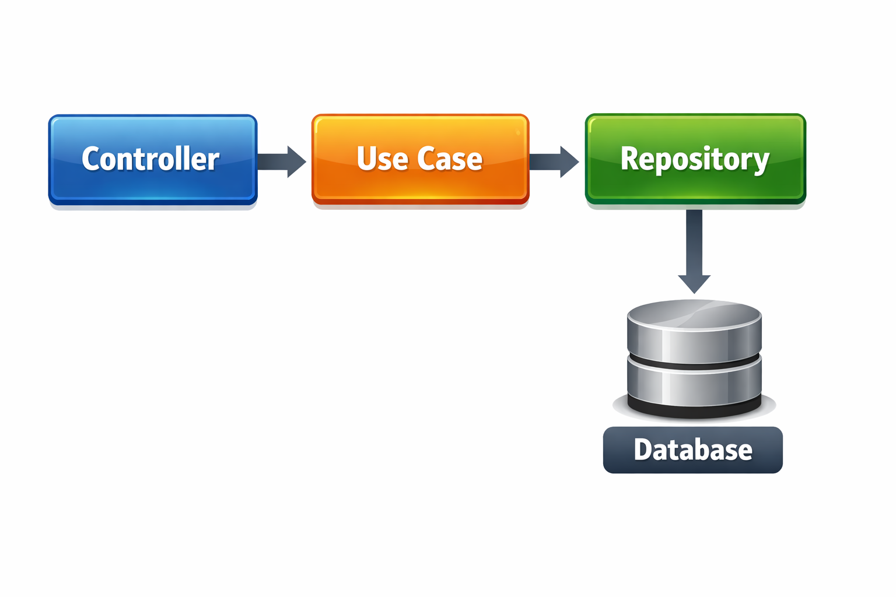

# Yumeko Backend

<div align="center">


Backend de autenticação OAuth com Discord, seguindo os princípios de **Clean Architecture**.

</div>

---

## 📋 Índice

- [Sobre](#-sobre)
- [Tecnologias](#-tecnologias)
- [Começando](#-começando)
- [Scripts](#-scripts)
- [API Reference](#-api-reference)
- [Variáveis de Ambiente](#-variáveis-de-ambiente)
- [Arquitetura](#-arquitetura)
- [Segurança](#-segurança)
- [Desenvolvimento](#-desenvolvimento)

---

## 📖 Sobre

Sistema de autenticação via Discord OAuth 2.0, permitindo que usuários façam login com suas contas do Discord. Implementa:
- OAuth flow completo com Discord
- Sessões persistentes com cookies seguros
- Renovação automática de tokens
- Criptografia de tokens no banco de dados
- Arquitetura limpa e escalável

---

## 🚀 Tecnologias

| Tecnologia | Versão | Uso |
|-----------|--------|-----|
| Node.js | 24+ | Runtime |
| Fastify | 5.x | Framework HTTP |
| Drizzle ORM | 0.45+ | ORM |
| MySQL | 8.x | Banco de dados |
| Zod | 4.x | Validação |
| Vitest | 4.x | Testes |
| TypeScript | 5.9+ | Linguagem |

---

## 🏃 Começando

### Pré-requisitos

- Node.js 24+
- MySQL 8+
- npm ou pnpm

### Instalação

```bash
# Clonar repositório
git clone <repo-url>
cd yumeko-backend

# Instalar dependências
npm install

# Configurar variáveis de ambiente
cp .env.example .env
# Edite o .env com suas credenciais
```

### Configuração do Banco

```bash
# Criar banco de dados
mysql -u root -p -e "CREATE DATABASE yumeko;"

# Gerar e aplicar migrations
npm run db:generate
npm run db:migrate
```

### Execução

```bash
# Desenvolvimento
npm run dev

# Produção
npm run build
npm start

# Docker
docker-compose up -d
```

---

## 📜 Scripts

| Script | Descrição |
|--------|-----------|
| `npm run dev` | Iniciar servidor em desenvolvimento com hot-reload |
| `npm run build` | Compilar TypeScript para JavaScript |
| `npm run start` | Iniciar servidor em produção |
| `npm run lint` | Verificar lint e tipos |
| `npm run lint:fix` | Corrigir problemas de lint automaticamente |
| `npm run test` | Executar todos os testes |
| `npm run test:watch` | Executar testes em modo watch |
| `npm run db:generate` | Gerar arquivos de migration |
| `npm run db:migrate` | Aplicar migrations no banco |
| `npm run db:studio` | Abrir interface gráfica do banco |

---

## 🔌 API Reference

### Autenticação

#### `GET /api/v1/auth/discord`
Retorna a URL de autorização do Discord.

**Resposta:**
```json
{
  "url": "https://discord.com/api/oauth2/authorize?..."
}
```

#### `GET /api/v1/auth/discord/callback`
Callback do OAuth. Cria sessão e redireciona.

**Query Parameters:**
- `code` (obrigatório): Código de autorização

#### `POST /api/v1/auth/logout`
Encerra a sessão atual.

**Resposta:**
```json
{
  "message": "Logged out successfully"
}
```

#### `POST /api/v1/auth/logout-all`
Encerra todas as sessões do usuário.

**Resposta:**
```json
{
  "message": "Logged out from all devices"
}
```

#### `POST /api/v1/auth/refresh`
Renova o token de acesso do Discord.

**Resposta:**
```json
{
  "message": "Token refreshed"
}
```

#### `GET /api/v1/auth/me`
Retorna informações do usuário autenticado.

**Resposta:**
```json
{
  "id": "uuid",
  "username": "username",
  "avatar": "avatar_hash"
}
```

---

### Health Checks

#### `GET /health`
Liveness probe para Kubernetes.

**Resposta:**
```json
{
  "status": "ok"
}
```

#### `GET /ready`
Readiness probe - verifica conexão com banco.

**Resposta (200):**
```json
{
  "status": "ok"
}
```

**Resposta (503):**
```json
{
  "status": "error",
  "error": "Database unavailable"
}
```

---

## 🔐 Variáveis de Ambiente

| Variável | Obrigatório | Descrição |
|----------|-------------|-----------|
| `DATABASE_URL` | ✅ | Connection string MySQL |
| `DISCORD_CLIENT_ID` | ✅ | Client ID da aplicação Discord |
| `DISCORD_CLIENT_SECRET` | ✅ | Client Secret da aplicação Discord |
| `DISCORD_REDIRECT_URI` | ✅ | URI de callback OAuth |
| `ENCRYPTION_KEY` | ✅ | Chave AES-256 (32+ caracteres) |
| `SESSION_SECRET` | ✅ | Secret para sessões (32+ caracteres) |
| `PORT` | ❌ | Porta do servidor (padrão: 3000) |
| `NODE_ENV` | ❌ | Ambiente: development/production |
| `CORS_ORIGIN` | ❌ | Origens CORS permitidas |
| `LOG_LEVEL` | ❌ | Nível de log (padrão: info) |

---

## 🏗️ Arquitetura

### Diagrama de Arquitetura



### Estrutura de Pastas

```
src/
├── domain/
│   ├── entities/          # Entidades de domínio
│   │   ├── session.ts
│   │   └── user.ts
│   └── repositories/      # Interfaces dos repositórios
│       ├── sessions-repository.ts
│       └── users-repository.ts
│
├── features/
│   └── auth/              # Feature de autenticação
│       ├── auth-controller.ts
│       ├── get-current-user.ts
│       ├── get-discord-auth-url.ts
│       ├── handle-discord-callback.ts
│       ├── logout-all.ts
│       ├── logout.ts
│       └── refresh-token.ts
│
├── infrastructure/
│   ├── config/           # Configuração da aplicação
│   ├── crypto/           # Utilitários de criptografia
│   ├── db/               # Schema e conexão Drizzle
│   ├── logger/           # Configuração de logging
│   └── repositories/      # Implementações dos repositórios
│
├── plugins/               # Plugins Fastify
│   ├── dependency-injection.ts
│   ├── error-handler.ts
│   ├── health.ts
│   ├── rate-limit.ts
│   └── swagger.ts
│
├── app.ts                # Configuração principal
└── server.ts            # Ponto de entrada
```

### Fluxo de Dados

```
┌─────────────┐     ┌─────────────┐     ┌─────────────┐
│  Controller │ ──▶ │  Use Case  │ ──▶ │ Repository  │
└─────────────┘     └─────────────┘     └─────────────┘
                                            │
                                            ▼
                                      ┌─────────────┐
                                      │   Database  │
                                      └─────────────┘
```

---

## 🔒 Segurança

- **Tokens criptografados**: Tokens Discord armazenados com AES-256-GCM
- **Cookies seguros**: HTTP-only, SameSite=Lax, Secure em produção
- **Validação de input**: Schema validation com Zod
- **Rate limiting**: Proteção contra ataques de força bruta
- **Headers de segurança**: Helmet.js configurado

---

## 🔧 Desenvolvimento

### Setup Discord OAuth

1. Acesse [Discord Developer Portal](https://discord.com/developers/applications)
2. Crie uma nova aplicação
3. Na seção **OAuth2**:
   - Adicione redirect URI: `http://localhost:3000/api/v1/auth/discord/callback`
   - Copie o **Client ID**
   - Gere e copie o **Client Secret**
4. Configure as variáveis no `.env`

### Boas Práticas

- Commits atômicos e descritivos
- Testes unitários para lógica de negócio
- Reviews antes de merge
- Documentação atualizada

---

## 📄 Licença

Este projeto está sob a licença MIT. Veja o arquivo [LICENSE](LICENSE) para mais detalhes.

---

<div align="center">

Feito com ❤️

</div>
